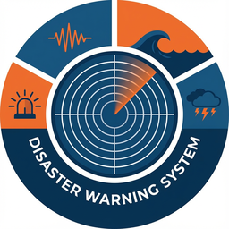

<!-- markdownlint-disable MD033 -->

<p align="center">
  
</p>

<h1 align="center">灾害预警 · 独立 Web 仪表盘</h1>

<p align="center">
  
  
</p>

> 📢 实时灾害预警信息推送展示面板，通过 WebSocket 连接后端获取全部数据，纯只读安全设计。

---

## 项目简介

本项目是 [astrbot_plugin_disaster_warning](https://github.com/DBJD-CR/astrbot_plugin_disaster_warning) 的**独立前端仪表盘**。

后端插件负责多数据源灾害预警数据的采集、处理与推送（支持 AstrBot / 独立运行），本前端项目提供一个美观、实时的 **只读监控面板**，可独立部署到任意静态服务器，通过 WebSocket 连接后端展示：

- 📢 **实时推送** — 预警消息流，支持按类型和地区筛选
- 📊 **运行状态** — 服务心跳、连接状态、数据源健康监控
- 📋 **事件列表** — 历史灾害事件，支持分页、分类、震级过滤
- 📈 **数据统计** — 震级分布、趋势图、热力图、排行榜

### 设计原则

- **纯只读**：前端无法控制后端，所有数据通过 WebSocket 获取，无 HTTP API 调用
- **安全**：WebSocket 只支持 `ping` / `refresh` / `query_events` 三种读操作
- **独立部署**：不依赖 AstrBot 框架，可部署到 Nginx / GitHub Pages / 任意静态托管

---

## 快速开始

### 1. 配置后端地址

编辑 `js/config.js`：

```js
window.__API_BASE_URL__ = 'http://127.0.0.1:8089';
```

### 2. 启动静态服务

```bash
npx serve .          # Node.js
# 或
python -m http.server 3000
```

### 3. 访问

浏览器打开 `http://127.0.0.1:3000`

---

## 项目结构

```
├── index.html              # 入口页面
├── js/
│   ├── config.js           # 后端连接配置
│   ├── app.jsx             # React 应用入口
│   ├── services/
│   │   ├── dashboardData.js    # WebSocket 数据管理器
│   │   ├── webSocketClient.js  # WebSocket 连接客户端
│   │   └── statsNormalizer.js  # 统计数据归一化
│   ├── views/
│   │   ├── PushMessagesView.jsx  # 实时推送（首页）
│   │   ├── StatusView.jsx        # 运行状态
│   │   ├── EventsView.jsx        # 事件列表
│   │   └── StatsView.jsx         # 数据统计
│   ├── components/          # React 组件
│   ├── hooks/               # React Hooks
│   ├── context/             # 全局状态管理
│   └── routes/              # 视图路由注册
├── css/                     # 样式表
├── lib/                     # React / MUI / Babel 运行时
└── logo.png
```

---

## 数据流

```
浏览器                       后端 (FastAPI)
  │                              │
  ├─ WebSocket ────────────────► ├─ /dashboard/ws
  │  {type:'ping'}               │  └─ DashboardConnector
  │  {type:'refresh'}            │     ├─ full_update (状态/统计/事件/趋势/热力图)
  │  {type:'query_events',...}   │     ├─ update (周期性快照)
  │                              │     ├─ event (新灾害事件)
  │  ◄────────────────────────── │     ├─ push_message (实时推送)
  │                              │     └─ events_result (事件查询)
  │                              │
  └─ 纯只读，无任何控制能力 ──────┘
```

---

## 安全测试

详见后端项目 [web_server.py](https://github.com/DBJD-CR/astrbot_plugin_disaster_warning/blob/main/core/network/admin/host/web_server.py) 中的 `dashboard_ws_endpoint`。

WebSocket 接口经过完整安全测试：

| 操作 | 结果 |
|---|---|
| `ping` / `refresh` / `query_events` | ✅ 可用（只读） |
| `simulate` / `reconnect` / `reset` / `shutdown` | ❌ 全部忽略 |
| SQL 注入 / 命令注入 / 原型污染 | ❌ 全部忽略 |
| 非 JSON / 二进制 / 空消息 | ❌ 全部忽略 |
| 洪水攻击 / 深度嵌套 | ❌ 已防护 |

---

## 相关项目

| 项目 | 说明 |
|---|---|
| [astrbot_plugin_disaster_warning](https://github.com/DBJD-CR/astrbot_plugin_disaster_warning) | 后端插件（数据采集 + 推送） |
| [web_disaster_warning](https://github.com/haotianshouwang/web_disaster_warning) | 后端 Web 独立版（本前端的配套后端） |

---

## 致谢

感谢 [@DBJD-CR](https://github.com/DBJD-CR) 和 **Aloys233** 开发的 [astrbot_plugin_disaster_warning](https://github.com/DBJD-CR/astrbot_plugin_disaster_warning) 灾害预警插件，提供了强大的多数据源灾害数据采集与推送能力，本项目在此基础上构建了独立的 Web 可视化仪表盘。

## 作者

**前端仪表盘**：[昊天兽王](https://github.com/haotianshouwang)

## 许可证

[AGPL-3.0](LICENSE)
